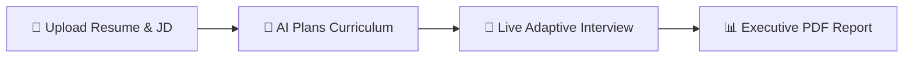

<p align="center">
  
</p>

<h1 align="center">
  🤖 <span style="color: #6366F1;">IntervIO</span>
</h1>

<p align="center">
  <strong>Autonomous Multimodal Adaptive Technical HR &amp; Talent Assessment Platform</strong><br/>
  <em>Built for hackathons, enterprises, and real-world technical hiring pipelines.</em>
</p>

<p align="center">
  
  
  
  
  
  
  
  
</p>

---

## 💡 What is IntervIO?

> **The Problem**: Traditional technical interviews are static, biased, and disconnected from a candidate's actual skills and resume context. Generic question banks fail to evaluate real competency.

> **The Solution**: IntervIO is an **AI-powered autonomous interview platform** that reads a candidate's resume, dynamically designs a personalised 3-stage technical interview, conducts it in real-time via a live web UI, and generates a professional enterprise-grade PDF assessment report — completely automatically.

Whether you're an **HR professional** evaluating candidates, a **developer** building hiring tools, or a **student** exploring AI applications, IntervIO demonstrates the full stack of modern AI-augmented product engineering.

---

## 🎯 How It Works — User Journey



| Step | What Happens | Who Does It |
|:---:|:---|:---|
| **1** | Recruiter or candidate uploads a resume (PDF/DOCX) and optionally a Job Description | Human |
| **2** | IntervIO parses verified skills, technologies, and career claims — then the Gemini AI autonomously designs a personalised 20-question, 3-stage interview curriculum | 🤖 AI |
| **3** | The candidate enters the live interview room, answers questions via text or voice, while the optional camera panel measures composure and engagement | Human + 🤖 AI |
| **4** | Upon completion, the system instantly produces an executive HR scorecard with competency grades (A+ to D), strengths, gap analysis, and a downloadable PDF dossier | 🤖 AI |

---

## 🌟 Core Features

| Feature | Description |
|:---|:---|
| 🧩 **3-Stage Adaptive Curriculum** | 20 dynamically-selected questions across Easy, Moderate & Tricky difficulty — never the same interview twice |
| 📄 **Resume-Personalised Questions** | Every question is tied directly to the candidate's own stated skills, projects, and experience claims |
| 📷 **Live Composure Telemetry** | Optional camera panel measures poise, gaze stability, fidget level, and engagement — no raw video stored |
| 🔒 **AES-256 PII Encryption** | Candidate names, resume text, and answers are encrypted at rest with Fernet symmetric keys |
| 📑 **Enterprise PDF Report** | Server-side ReportLab PDF dossier with HR scorecards, competency grades, and biometric poise data |
| 🌐 **Multi-Stack Evaluation** | Evaluates React, TypeScript, Go, Java, Spring, Node.js, Python, PostgreSQL, Redis, Docker, Kubernetes |

---

## 📐 Architecture Overview

```text
IntervIO/
├── backend/                    # FastAPI REST API (Python)
│   ├── api/
│   │   └── interviews.py       # Adaptive curriculum planner, question engine, grading logic
│   ├── schemas/
│   │   └── interview.py        # Pydantic v2 domain schemas (InterviewState, HREvaluation, etc.)
│   ├── pdf_report.py           # ReportLab Platypus PDF dossier generator
│   ├── security.py             # AES-256 Fernet encryption & LLM PII scrubbing
│   └── main.py                 # FastAPI app, dynamic CORS, route registry
├── frontend/                   # Next.js 16 + React 19 + TypeScript
│   ├── app/
│   │   ├── page.tsx            # Onboarding: resume & JD upload, curriculum generation
│   │   ├── interview/page.tsx  # Live interview room with camera panel & voice input
│   │   └── report/page.tsx     # Executive HR dossier with one-click PDF download
│   ├── components/             # Reusable UI: CameraPanel, AgentTrace, VoiceInput
│   └── lib/api.ts              # Centralised API base URL (configurable for deployment)
├── multimodal/                 # Core AI & Signal Processing
│   ├── gemini_assistant.py     # Gemini 2.0 Flash reasoning & agentic HR evaluation
│   ├── resume_analyzer.py      # Deterministic PDF/DOCX skill & fact extractor
│   ├── visual_analyzer.py      # Camera frame poise and composure measurements
│   └── voice_analyzer.py      # Audio delivery, pitch, volume & speech pacing
└── tests/                      # 89 automated tests covering all core subsystems
```

---

## 🚀 Quick Start (Run Locally in 5 Minutes)

### Prerequisites
- **Python** 3.11+ (3.13 recommended)
- **Node.js** 18+ (Node 20+ recommended)
- A **Google Gemini API Key** → [Get one free here](https://aistudio.google.com/app/apikey)

---

### Step 1 — Backend Setup

```powershell
# From the project root: person3-evaluation/
python -m pip install -r requirements.txt
```

Create a `.env` file in the project root (or rename the existing one):

```ini
GEMINI_API_KEY=your_gemini_api_key_here
GEMINI_MODEL=gemini-2.0-flash
INTERVIEW_ENCRYPTION_KEY=your_fernet_key_here
```

> 💡 Generate a fresh Fernet key: `python -c "from cryptography.fernet import Fernet; print(Fernet.generate_key().decode())"`

Start the backend server:

```powershell
python -m uvicorn backend.main:app --host 127.0.0.1 --port 8000 --reload
```

| URL | Purpose |
|:---|:---|
| http://127.0.0.1:8000 | API Root |
| http://127.0.0.1:8000/docs | Interactive Swagger API Docs |
| http://127.0.0.1:8000/health | Health Check |

---

### Step 2 — Frontend Setup

```powershell
# In a new terminal from: person3-evaluation/frontend/
npm install
npm run dev
```

| URL | Purpose |
|:---|:---|
| http://localhost:3000 | Main App — Upload Resume & Start Interview |
| http://localhost:3000/interview | Live Interview Room |
| http://localhost:3000/report | Executive Assessment Report |

---

## 🌐 Production Deployment

When deploying to cloud services, configure the following environment variables:

| Service | Variable | Value |
|:---|:---|:---|
| **Frontend** (Vercel/Netlify) | `NEXT_PUBLIC_API_URL` | Your backend URL e.g. `https://your-api.onrender.com` |
| **Backend** (Render/Railway) | `CORS_ORIGINS` | Your frontend URL e.g. `https://your-app.vercel.app` |
| **Backend** | `GEMINI_API_KEY` | Your Google Gemini API key |
| **Backend** | `INTERVIEW_ENCRYPTION_KEY` | Your Fernet encryption key |

---

## 📡 Key API Endpoints

| Method | Endpoint | Description |
| :--- | :--- | :--- |
| `GET` | `/health` | Server health check |
| `POST` | `/interviews/` | Initialize an interview session |
| `POST` | `/interviews/{id}/resume` | Upload and parse candidate resume (PDF / DOCX) |
| `POST` | `/interviews/{id}/job-description` | Attach company, role, and JD details |
| `POST` | `/interviews/{id}/start` | Generate curriculum plan & opening question |
| `POST` | `/interviews/{id}/answer` | Submit answer & receive next adaptive question |
| `POST` | `/interviews/{id}/end` | Conclude session |
| `GET` | `/interviews/{id}/assessment` | Retrieve aggregate HR scorecard & grades |
| `GET` | `/interviews/{id}/assessment/pdf` | **Download official PDF assessment report** |

---

## 🧪 Automated Test Suite

```powershell
pytest
```

**Result**: `89 passed` across all core subsystems — PDF generation, adaptive curriculum, AES-256 encryption, scoring engine, camera telemetry, API robustness, and voice processing.

---

## 👥 Core Team & Contributors

| Name | GitHub | Role |
|:---|:---|:---|
| **Shreya Patha** | [@shreya661](https://github.com/shreya661) | Architecture & Fullstack |
| **Ajay Singh** | [@ajaysingh959934-ctrl](https://github.com/ajaysingh959934-ctrl) | Evaluation Engine & Telemetry |
| **Vandhana** | [@vandhana93](https://github.com/vandhana93) | Frontend UI/UX & Assessment Reporting |
| **Nandini Bingi** | [@nandinibingi02-max](https://github.com/nandinibingi02-max) | Testing, Curriculum & Quality Assurance |
