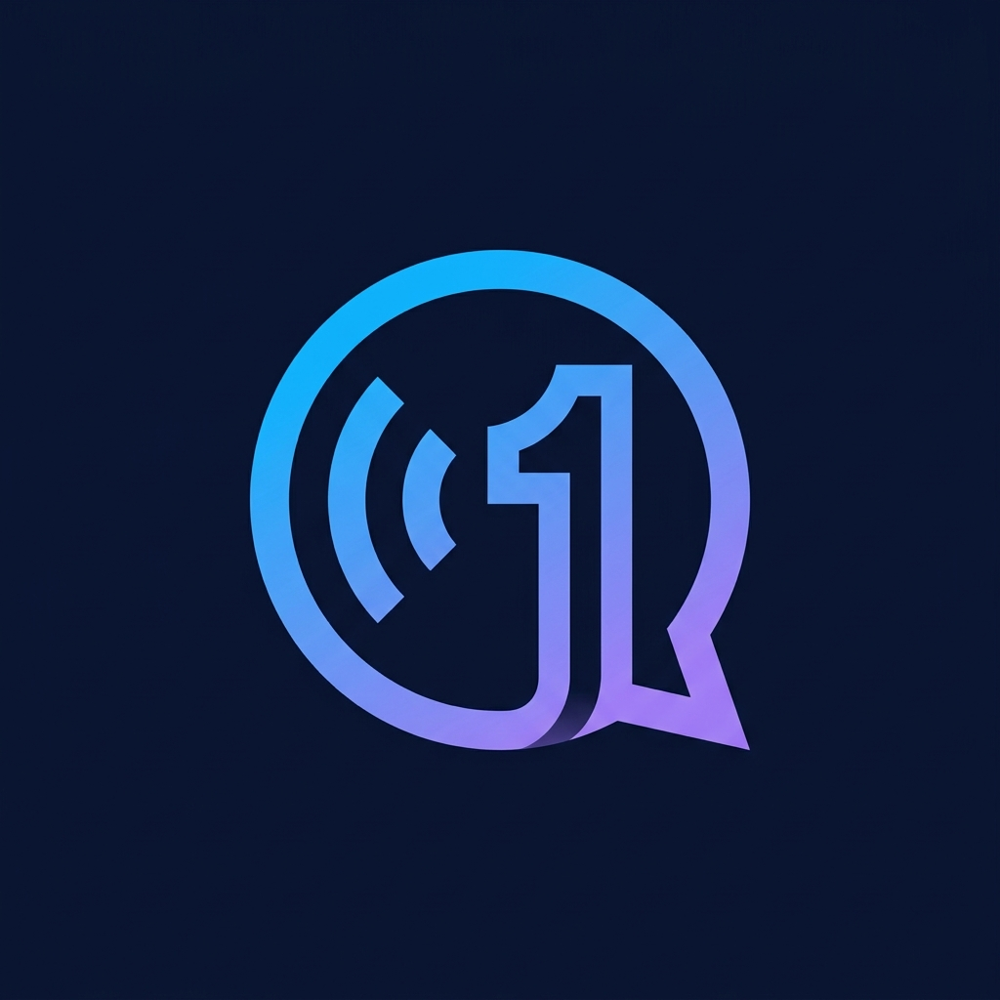

<p align="center">
  
</p>

<h1 align="center">
  🤖 <span style="color: #6366F1;">InterviewOne AI</span>
</h1>

<p align="center">
  <strong>Autonomous Multimodal Adaptive Technical HR & Talent Partner Assessment Platform</strong><br/>
  <em>Personalized 3-stage adaptive evaluations, real-time composure telemetry, AES-256 encrypted PII, and one-click official PDF report dossiers.</em>
</p>

<p align="center">
  
  
  
  
  
  
  
  
</p>

---

## 🌟 Key Highlights & Innovations

- **3-Stage Adaptive HR Curriculum (20 Questions)**:
  - **Stage 1 (Q1–10, Easy & Logic)**: Warm welcoming introduction, career journey walkthrough, role motivation, and core syntax/execution mechanics in candidate's stack.
  - **Stage 2 (Q11–15, Moderate & System Trade-offs)**: Hands-on verification of specific claims, projects, achievements, and technical design decisions on the candidate's resume.
  - **Stage 3 (Q16–20, Tricky Edge Cases & Behavioral)**: STAR situational dilemmas, conflict resolution, production incident ownership, and culture fit.
- **Multimodal Telemetry & Composure Analysis**:
  - Optional real-time camera tracking evaluating poise, gaze stability, and fidget indices under cognitive load (observational coaching signals only — zero raw video stored).
- **Direct Enterprise PDF Report Dossier**:
  - One-click server-side PDF generation using ReportLab Platypus featuring executive HR scorecards (Grades A+ to D), candidate strengths/gaps breakdown, and biometric poise telemetry.
- **Multi-Stack Context Engine**:
  - Evaluates candidate claims across React, TypeScript, Go, Java, Spring, Node.js, Python, PostgreSQL, Redis, Docker, and Kubernetes — not defaulted to Python.
- **Cryptographic PII Protection**:
  - AES-256 Fernet encryption for candidate names, raw resume text, and answer transcripts stored at rest with pre-flight PII scrubbing for third-party LLMs.

---

## 📐 Architecture Overview

```text
person3-evaluation/
├── backend/                    # FastAPI High-Throughput REST API
│   ├── api/
│   │   └── interviews.py       # Adaptive curriculum planner, question selector, grading engine
│   ├── schemas/
│   │   └── interview.py        # Pydantic v2 domain schemas (InterviewState, HREvaluation, etc.)
│   ├── pdf_report.py           # ReportLab Platypus PDF dossier generator with embedded brand logo
│   ├── security.py             # AES-256 Fernet symmetric encryption & LLM PII scrubbing
│   └── main.py                 # FastAPI application, CORS regex & route registry
├── frontend/                   # Modern Next.js 16 + React 19 Client
│   ├── app/
│   │   ├── page.tsx            # Setup, resume parsing & personalized plan generation
│   │   ├── interview/page.tsx  # Live interactive interview room with camera panel
│   │   ├── report/page.tsx     # Executive HR candidate dossier & one-click PDF download
│   │   └── icon.png            # Mascot app icon & favicon
│   ├── components/             # Reusable UI components (CameraPanel, telemetry HUD)
│   └── public/logo.png         # Transparent brand mascot emblem
├── multimodal/                 # Core AI & Signal Processing
│   ├── gemini_assistant.py     # Gemini 2.0 Flash reasoning & Agentic HR evaluation
│   ├── resume_analyzer.py      # Deterministic PDF/DOCX skill & fact extractor
│   ├── visual_analyzer.py      # Camera frame poise and composure measurements
│   └── voice_analyzer.py       # Audio delivery, pitch, volume, and speech pacing
└── tests/                      # Automated Verification Suites (89 tests passing)
```

---

## 🚀 Quick Start Guide

### 1. Prerequisites
- **Python**: 3.11+ (Python 3.13 recommended)
- **Node.js**: 18+ (Node 20+ recommended)

---

### 2. Backend Setup & Run

1. Open a terminal in `person3-evaluation/`:
   ```powershell
   python -m pip install -r requirements.txt
   ```

2. Configure environment variables in `.env` (already pre-configured):
   ```ini
   GEMINI_API_KEY=your_gemini_key_here
   GEMINI_MODEL=gemini-2.0-flash
   INTERVIEW_ENCRYPTION_KEY=d1dF-lkhVZZICI9lBMN4xVPs_DwG507YptQHFqUPk9A=
   ```

3. Launch the FastAPI backend server:
   ```powershell
   python -m uvicorn backend.main:app --host 127.0.0.1 --port 8000 --reload
   ```
   - **API Server**: [http://127.0.0.1:8000](http://127.0.0.1:8000)
   - **Interactive Swagger Docs**: [http://127.0.0.1:8000/docs](http://127.0.0.1:8000/docs)
   - **Health Check**: [http://127.0.0.1:8000/health](http://127.0.0.1:8000/health)

---

### 3. Frontend Setup & Run

1. Open a second terminal in `person3-evaluation/frontend`:
   ```powershell
   npm install
   npm run dev
   ```

2. Open your browser and navigate to:
   - **Web Application**: [http://localhost:3000](http://localhost:3000)
   - **Live Interview Room**: [http://localhost:3000/interview](http://localhost:3000/interview)
   - **Assessment Dossier**: [http://localhost:3000/report](http://localhost:3000/report)

---

## 📡 Key API Endpoints

| Method | Endpoint | Description |
| :--- | :--- | :--- |
| `GET` | `/health` | Server health check and diagnostic status |
| `POST` | `/interviews/` | Initialize an interview session (accepts JSON body or query params) |
| `POST` | `/interviews/{id}/resume` | Upload and parse candidate resume (PDF / DOCX) |
| `POST` | `/interviews/{id}/job-description` | Attach target company, role, and JD requirements |
| `POST` | `/interviews/{id}/start` | Generate 3-stage curriculum plan and synthesize opening question |
| `POST` | `/interviews/{id}/answer` | Submit answer with optional visual signal telemetry & receive next question |
| `POST` | `/interviews/{id}/end` | Conclude session (idempotent) |
| `GET` | `/interviews/{id}/assessment` | Retrieve aggregate HR scorecard, grades, composure data |
| `GET` | `/interviews/{id}/assessment/pdf` | **Download official PDF assessment report dossier** |

---

## 🧪 Automated Testing

Run the full automated test suite:
```powershell
pytest
```
**Result**: `89 passed, 1 skipped (audio hardware)` across all core subsystems (PDF generator, multi-stack curriculum, AES encryption, scoring, and API robustness).